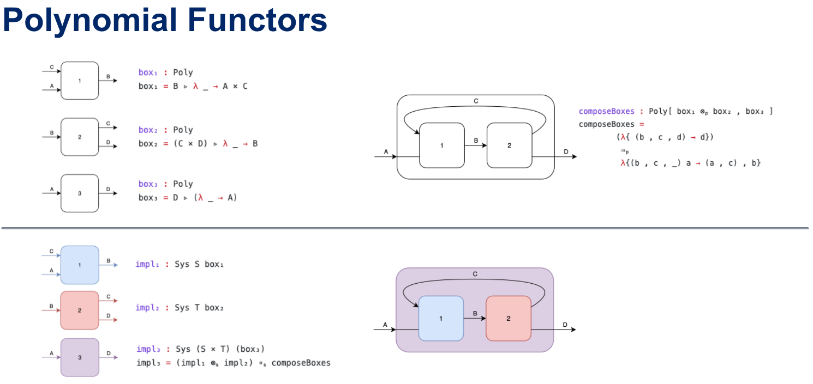

Attempting to formalize concepts from https://topos.site/poly-course/

and also http://davidjaz.com/Papers/DynamicalBook.pdf

Some code snippits are taken from /influenced by

https://plfa.github.io/

https://github.com/agda/agda-categories

Agda unicode input
https://people.inf.elte.hu/divip/AgdaTutorial/Symbols.html

Q: are these the polynomial functors topologists and category theorists expect
https://github.com/smimram/fibred-polynomials
https://deepai.org/publication/a-cartesian-bicategory-of-polynomial-functors-in-homotopy-type-theory

TODO:
- See also Agda stdlib containers
- Can quantum circuits be expressed using Poly?
- mu and nu for least and greatest fixed point
- coalgebras (and unfold) as an alternative definition for systems 
- relation to profunctors for optics?
- Directed containers and Derivatives of Poly http://www.cs.nott.ac.uk/~psztxa/publ/jpartial.pdf https://danel.ahman.ee/papers/fossacs12.pdf
- https://diagrams.github.io/ (drawing wiring diagrams?)

Prove comonads in poly are categories
